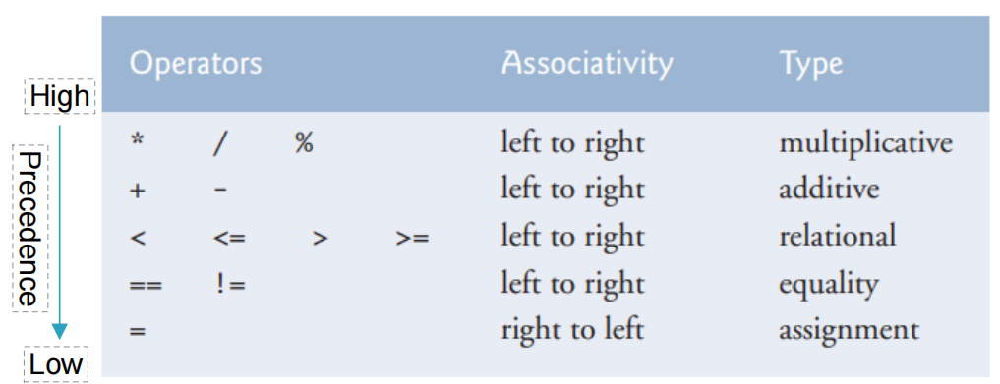

# SUSTech CS109期末复习笔记
> 现在是2025年6月12日星期四20:34，我要开始突击JavaA了
# Chapter1： Introduction to Computers, Programs, and Java
## What is a computer?
- 分为硬件（CPU RAM Disk等）和软件（操作系统、应用程序等）两部分
- 硬件受软件引导执行命令和指令
## What is a computer program?
- 计算机程序是一组机器可读的指令，用于告知计算机如何执行特定任务
## What is a (programming) language?
- 低级语言：给电脑理解的
- 高级语言：给人类理解的
## 编译器 Compiler 
- 将用**高级语言**编写的**程序源代码**转换成能在计算机上运行的**机器码(machine code)**
## 解释器 Interpreter 
- 从源代码读取**一行指令**、转换成**机器码或虚拟机器码**并**立即**执行
## Java简史
- 1994年Sun Microsystems公司（2009年被Oracle收购）创立的项目，目标是"write once, run anywhere"。这个基于**C++**的语言被命名为**Java**
- 为什么叫Java？因为爪哇（Java）岛盛产咖啡，而“程序员要喝大量的咖啡”
- Java之父：James Gosling
- Java的第一个版本：JDK1.0，1996年10月23日发布
## 编写Java程序步骤
1. 编写源代码
2. 编译源代码成**字节码**：javac hello.java
3. 在**JVM(Java Virtual Machine)**读取、识别、**解释**、运行**字节码**：java hello  


> Java既是**编译型**语言又是**解释型**语言的原因：第2步是**编译**、第3步为**解释**  
加入了中间件（字节码）兼顾跨平台和性能，在不同平台上使用不同的JVM运行字节码  
(Write Once and Run Anywhere)
## JVM 和 JRE 和 JDK
- JVM(Java Virtual Machine ): 运行Java程序的虚拟机
- JRE(Java Runtime Environment): Java运行时环境，提供JVM及核心类库
- JDK(Java Development Kit): Java开发套件，包括
    1. JRE
    2. 编译器Compiler( **javac** )
    3. 解释器Interpreter( **java** )
    4. 其他开发工具

- 总结：JRE = JVM + 类库；JDK = JRE + 开发工具
## 第一个程序
```Java
public class Welcome1{
    //程序入口
    public static void main(String[] args){
        System.out.println("Hello World");
    }
}
```
输出：`Hello World!`
## 一些术语解释
### Keyword 关键词
- Java保留，全部小写。例如：`class` , `new` , `public` , `static`等
### Identifiers 标识符
- `Welcome1`是一个标识符，是类名
- 只允许**大小写英文字母和数字**、**$**和**_**（下划线）
- 不允许数字开头。例如：`123name`不是一个合法的标识符
#### 标识符命名
- 使用驼峰式命名规范（Camel Case），**大写**除了第一个单词之外的单词**首字母**。
- 对于类名，第一个单词的首字母也应大写，例如：`ClassName`
- 对于常量，所有字母均应大写，例如：`public static final double PI = 3.14;`
- 对于其他标识符，大写除了第一个单词之外的单词首字母。例如：`myMethod`, `myParameter`等
- Java对于大小写敏感，所以`main`和`Main`是不同的标识符
### Comments 注释
```Java
//这是一个行注释

/*这是一个多行注释，
它可以跨行
*/
```
- 注释帮助人类理解程序代码
- 编译器会忽略所有注释
- 多行注释不会嵌套，在第一个`/*`之后的第一个`*/`相互配对
```Java
/*
    /*第一行 */
    第二行 */ --> 语法错误
```
- 单行注释可以包括任何东西
```Java
// /* 这样的注释是合法的 */
```
### Braces 花括号
- 标识一个代码块
- 标识每个类的方法的开始和结束（不可或缺）

### Indentation 缩进
- 缩进仅方便阅读代码，并不会影响编译和执行

## Escape Charactor 转义字符
- `\`是**转义字符**，和下一个字符共同构成**转义序列**，例如`\n`
- 常用转义序列
    1. `\n`: 换行符
    2. `\t`: Tab
    3. `\"`,`\'`,`\\`等：输出特殊字符。例如：`System.out.println("\"in quotes\"");`输出： "in quotes"
## Bug
- 编译错误 Compile Error: 程序语法存在问题
- 运行时错误 Runtime Error: 程序抛出异常，例如：数组越界等
- 逻辑错误 Logical Error: 程序运行但得到了错误的结果

# Chapter2: Data Typesa & Computation

## 数据类型 Data Types
- Java里数据类型分为**基本数据类型（Primitive data type）**和**复杂数据类型（Complex data type）**，后者也称为**引用类型（Reference type）**或者非基本数据类型
### 基本数据类型 Primitive data type
- 整数类型 Integral types: `byte`, `short`, `int`, `long`  -> 整数
- 浮点数类型 Floating-point types : `float`, `double`  -> 小数
- 布尔类型 boolean data type : true & false
- 字符类型 char data type : 字符
#### 整数类型
| Type  |  Size  |       Range        |
| :---: | :----: | :----------------: |
| byte  | 8 bits |    -128 to +127    |
| short | 16 bits |  -32768 to +32767  |
|  int  | 32 bits | -21.47亿 to +21.47亿 |
| long  | 64 bit  |  -10^18 to +10^18  |
|       |        |                    |
#### 浮点数类型
| Type  |  Size  |       Range        |
| :---: | :----: | :----------------: |
| float（单精度）  | 32 bits |    -3.4*10^38 to +3.4*10^38  |
| double（双精度） | 64 bits |  -1.7*10^308 to +1.7*10^308  |
- Example:
```Java
double pi=3.1415926;
float f=234.5f; //float类型需要在数字后面加上字母f，告知编译器这是个float类型
```
- `float`类型可以保存小数点后**7**位数字
- `double`类型可以保存小数点后**16**位数字
#### 布尔类型
- 占用1个bit
- 只有两个可能值：`true`和`false`
#### 字符类型
- 代表单个16-bit Unicode字符
- 从'\u0000'到'\uffff'共65536个字符，涵盖大多数文字
- 例如：
```Java
char c1= 'a'; 
char c2= '\u5357';
char c3= '\u79d1';
char c4= '\u5927';
System.out.printf("%c %c %c", c2, c3, c4);
```
输出结果：南科大

## 算术运算 Arithmetic computation

### 算术运算符 Arithmetic operators
- （+ - * / % ）对应 加 减 乘 除 取余
- （* / %）优先级高于（+ -）
- `()`括号优先级最高
### 逻辑表达式 Conditional expressions
- 相同运算符 Equality operators：`==`,`!=`
- 关系运算符 Relational operators `>`,`<`,`>=`,`<=`
### 赋值运算符 Assignment operator
- `i=1`表达式的值是1
### 运算优先级及结合性总结 Precedence and associativity


## 格式字符串 Format String
- 使用`System.out.printf()`可以传入格式字符串，`String.format()`方法可以获取格式化后的字符串
### 格式说明符 Format Specifiers
- 以`%`开始，后接一个字母
- 例如：`%d`代表整数占位符，`%s`代表字符串占位符

# Chapter3: Control Statements
```Java
if(grade >= 60)
    System.out.println("Passed");
```
## 选择结构 Selection Structure 
### if结构
- `if`语句: 单路选择  

- `if...else`: 双路选择
示例：
```Java
if(grade >= 60)
    System.out.println("Passed");
else
    System.out.println("Failed");
```
三元运算符 Ternary Operator 
```Java
String result = grade >= 60 ? "Passed" : "Failed";
```
#### 多分支 multi-way
```Java
if (score >= 90)
    System.out.print("A");
else if (score >= 80)
   System.out.print("B");
else if (score >= 70)
    System.out.print("C");
else if(scorte >= 60)
    System.out.print("D");
else
    System.out.print("F");
```
#### 常见错误
1. 在else后面添加条件

2. 忘记添加必要的大括号

3. 模棱两可的配对

配对规则：`else`和最近的`if`配对
4. 错误的分号
```Java
if (score >= 90);  -> 错误的分号
    System.out.print("A");
```
### switch结构
- `switch`语句: 多路选择
## 循环结构 Repetition/Looping Struction 
- `while`语句
- `for`语句
- `do...while`语句