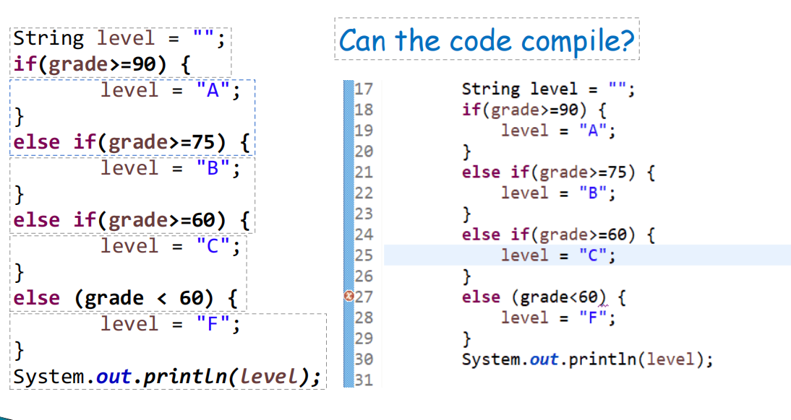

# SUSTech CS109期末复习笔记
> 现在是2025年6月12日星期四20:34，我要开始突击JavaA了  
喜报：现在是2025年6月15日星期日15:44，我突击完了

# 第1章：计算机、程序、Java简介 Introduction to Computers, Programs, and Java

## 计算机 Computer
- 分为硬件（CPU RAM Disk等）和软件（操作系统、应用程序等）两部分
- 硬件受软件引导执行命令和指令

## 计算机程序 Computer Program
- 计算机程序是一组机器可读的指令，用于告知计算机如何执行特定任务

## 编程语言 Programming Language
- 低级语言：给电脑理解的
- 高级语言：给人类理解的

## 编译器 Compiler 
- 将用**高级语言**编写的**程序源代码**转换成能在计算机上运行的**机器码**(machine code)

## 解释器 Interpreter 
- 从源代码读取**一行指令**、转换成**机器码或虚拟机器码**并**立即**执行

## Java简史
- 1994年Sun Microsystems公司（2009年被Oracle收购）创立的项目，目标是"write once, run anywhere"。这个基于**C++**的语言被命名为**Java**
- 为什么叫Java？因为爪哇（Java）岛盛产咖啡，而“**程序员要喝大量的咖啡**”
- Java之父：James Gosling
- Java的第一个版本：JDK1.0，1996年10月23日发布

## 编写Java程序步骤
1. 编写源代码
2. 编译源代码成**字节码**：javac hello.java
3. 在**JVM**(Java Virtual Machine)读取、识别、**解释**、运行**字节码**：java hello  


> Java既是**编译型**语言又是**解释型**语言的原因：第2步是**编译**、第3步为**解释**  
加入了中间件（**字节码**（ByteCode））兼顾跨平台和性能，在不同平台上使用不同的JVM运行字节码  
(Write Once and Run Anywhere)

## JVM 和 JRE 和 JDK
- JVM(Java Virtual Machine ): Java虚拟机，运行Java程序的虚拟机
- JRE(Java Runtime Environment): Java运行时环境，提供JVM及核心类库
- JDK(Java Development Kit): Java开发套件，包括
    1. JRE
    2. 编译器Compiler( **javac** )
    3. 解释器Interpreter( **java** )
    4. 其他开发工具

- 总结：JRE = JVM + 类库；JDK = JRE + 开发工具

## 第一个程序
```Java
public class Welcome1{
    //程序入口
    public static void main(String[] args){
        System.out.println("Hello World");
    }
}
```
输出：`Hello World!`

## 一些术语解释

### Keyword 关键词
- Java保留，全部小写。例如：`class` , `new` , `public` , `static`等

### Identifiers 标识符
- `Welcome1`是一个标识符，是类名
- 只允许**大小写英文字母和数字**、**$**和**_**（下划线）
- 不允许数字开头。例如：`123name`不是一个合法的标识符

#### 标识符命名
- 使用**驼峰式命名规范**（Camel Case），单词首字母大写，单词之间没有连接符。
- 对于类名，**所有单词**的首字母均大写，例如：`ClassName`。称之为大驼峰式命名规范（Upper Camel Case）
- 对于常量，所有字母均应大写，例如：`public static final double PI = 3.14;`
- 对于其他标识符，**首单词**的首字母小写，**后续单词**首字母大写。例如：`myMethod`, `myParameter`等。称之为小驼峰式命名规范（Lower Camel Case）
- Java对于大小写敏感，所以`main`和`Main`是不同的标识符

### Comments 注释
```Java
//这是一个行注释

/*这是一个多行注释，
它可以跨行
*/
```
- 注释帮助人类理解程序代码
- 编译器会忽略所有注释
- 多行注释不会嵌套，在第一个`/*`之后的第一个`*/`相互配对
```Java
/*
    /*第一行 */
    第二行 */ --> 语法错误
```
- 单行注释可以包括任何东西
```Java
// /* 这样的注释是合法的 */
```

### Braces 花括号
- 标识一个代码块
- 标识每个类的方法的开始和结束（不可或缺）

### Indentation 缩进
- 缩进仅方便阅读代码，并不会影响编译和执行

## Escape Charactor 转义字符
- `\`是**转义字符**，和下一个字符共同构成**转义序列**，例如`\n`
- 常用转义序列
    1. `\n`: 换行符
    2. `\t`: Tab
    3. `\"`,`\'`,`\\`等：输出特殊字符。例如：`System.out.println("\"in quotes\"");`输出： "in quotes"

## Bug
- 编译错误 Compile Error: 程序语法存在问题
- 运行时错误 Runtime Error: 程序抛出异常，例如：数组越界等
- 逻辑错误 Logical Error: 程序运行但得到了错误的结果

# 第2章: 数据类型和计算 Data Types & Computation

## 数据类型 Data Types
- Java里数据类型分为**基本数据类型**（Primitive data type）和**复杂数据类型**（Complex data type），后者也称为**引用类型**（Reference type）或者非基本数据类型

### 基本数据类型 Primitive data type
- 整数类型 Integral types: `byte`, `short`, `int`, `long`  -> 整数
- 浮点数类型 Floating-point types : `float`, `double`  -> 小数
- 布尔类型 Boolean data type : `true` & `false`
- 字符类型  : 字符

#### 整数类型 Integral types
| Type  |  Size  |       Range        |
| :---: | :----: | :----------------: |
| byte  | 8 bits |    -128 to +127    |
| short | 16 bits |  -32768 to +32767  |
|  int  | 32 bits | -21.47亿 to +21.47亿 |
| long  | 64 bit  |  -10^18 to +10^18  |
|       |        |                    |
#### 浮点数类型 Floating-point types
| Type  |  Size  |       Range        |
| :---: | :----: | :----------------: |
| float（单精度）  | 32 bits |    -3.4*10^38 to +3.4*10^38  |
| double（双精度） | 64 bits |  -1.7*10^308 to +1.7*10^308  |
- Example:
```Java
double pi=3.1415926;
float f=234.5f; // float类型需要在数字后面加上字母f，告知编译器这是个float类型
```
- `float`类型可以保存小数点后**7**位数字
- `double`类型可以保存小数点后**16**位数字
#### 布尔类型 Boolean data type
- 占用1个bit
- 只有两个可能值：`true`和`false`
#### 字符类型 Char data type
- 代表单个16-bit Unicode字符
- 从'\u0000'到'\uffff'共65536个字符，涵盖大多数文字，也包括emoji
- 例如：
```Java
char c1= 'a'; 
char c2= '\u5357';
char c3= '\u79d1';
char c4= '\u5927';
System.out.printf("%c %c %c", c2, c3, c4);
```
输出结果：南科大

## 算术运算 Arithmetic Computation

### 算术运算符 Arithmetic Operator
- （+ - * / % ）对应 加 减 乘 除 取余
- （* / %）优先级高于（+ -）
- `()`括号优先级最高
### 逻辑表达式 Conditional Expression
- 相同运算符 Equality operators：`==`,`!=`
- 关系运算符 Relational operators `>`,`<`,`>=`,`<=`
### 赋值操作符 Assignment Operator
- `i=1`表达式的值是1
### 组合赋值操作符 Compound Assignment Operator
- 例如`+=` , `-=` , `*=` , `*=` , `%=`
- `c = c + 3;`等同于`c += 3;`
## 自增、自减运算符 Increment & Decrement Operator
- `i++`,`++i`, `i--`, `--i`;
### 前缀自加、自减 Preincrementing & Predecrementing
- 先自加/减，在表达式中使用的为**新值**。
例如：
```Java
int a = 6;
int b = ++a;
```
a、b的值都是7
### 后缀自加、自减 Postincrementing & Postdecrementing
- 后自加/减，在表达式中使用的为**旧值**。
例如：
```Java
int a = 6;
int b = a++;
```
结果：a=7、b=6

## 逻辑运算 Logical Computation

### 逻辑运算符 Logical Operators
- `!` : 逻辑否，反转布尔值
- `&&` : 逻辑与，前后**均为**`true`时，表达式的值才为`true`
- `||` : 逻辑或，前后**有一个为**`true`时，表达式值就为`true`
- `^` :  逻辑异或，前后**相同时**是`false`，不同时值为`true`

### `||`和`&&`的短路求值 Short-circuit Evaluation
- 当表达式可以确定值时，计算终止
- 例如表达式`(1 == 2) && (3 == 3)`: 因为前面已经是`false`，整个表达式的值必为`false`，故后半部分不会计算
- 而`|`和`&`会全部计算
- 当后面的表达式有副作用时，使用`||`和`&&`就很有必要了

### 运算优先级及结合性总结 Precedence and associativity


## 格式字符串 Format String
- 使用`System.out.printf()`可以传入格式字符串，`String.format()`方法可以获取格式化后的字符串

### 格式说明符 Format Specifiers
- 以`%`开始，后接一个字母
- 例如：`%d`代表整数占位符，`%s`代表字符串占位符

# 第3章：控制语句 Control Statements 

## 选择结构 Selection Structure 

### if结构
- `if`语句: 单路选择  

- `if...else`: 双路选择
示例：
```Java
if(grade >= 60)
    System.out.println("Passed");
else
    System.out.println("Failed");
```
- 三元运算符 Ternary Operator 
```Java
String result = grade >= 60 ? "Passed" : "Failed";
```

#### 多分支 multi-way
```Java
if (score >= 90)
    System.out.print("A");
else if (score >= 80)
   System.out.print("B");
else if (score >= 70)
    System.out.print("C");
else if(scorte >= 60)
    System.out.print("D");
else
    System.out.print("F");
```

#### 常见错误
1. 在else后面添加条件

2. 忘记添加必要的大括号

3. 模棱两可的配对

配对规则：`else`和最近的`if`配对
4. 错误的分号
```Java
if (score >= 90);  -> 错误的分号
    System.out.print("A");
```
### switch结构
- `switch`语句: 多路选择
- `switch`语句中的变量类型可以是`byte`、`short`、`int` 、 `char`、`String`、`Enum`等。
- `switch`语句可以拥有多个`case`语句。每个`case`后面跟一个**要比较的值**和**冒号**。
- `case`语句中的值的数据类型必须与变量的数据类型相同，而且只能是**常量**或者**字面常量**。
- 当变量的值与`case`语句的值相等时，那么`case`语句之后的语句开始执行，直到`break`语句出现才会跳出`switch`语句。
- 当遇到`break`语句时，`switch`语句终止。程序跳转到`switch`语句后面的语句执行。`case`语句不必须要包含`break`语句。如果没有`break`语句出现，程序会继续执行下一条`case`语句，直到出现`break`语句。
- `switch`语句可以包含一个`default`分支，该分支一般是`switch`语句的最后一个分支（可以在任何位置，但建议在最后一个）。`default`在没有`case`语句的值和变量值相等的时候执行。
- **switch case 执行时，一定会先进行匹配，匹配成功返回当前 case 的值，再根据是否有 break，判断是否继续输出，或是跳出判断。**

## 循环结构 Repetition/Looping Struction 
- 计数器控制的循环 Counter-Controlled Repetition
- 边界值控制的循环 Sentinel-Controlled Repetition 
- `while`语句
- `for`语句
- `do...while`语句

## 伯姆-雅各皮尼定理 Böhm-Jacopini Theorem
任何算法的实现都**只需要**三种控制结构
1. 顺序结构 Sequence
2. 选择结构 Selection
3. 循环结构 Repetition

## 结构化程序设计规则 Forming Structured Programs
1. 从最简单的活动图（Activity diagram）开始
2. 堆叠规则 Stacking Rule: 任何动作状态（Action State）都能被两个连续的动作状态替代
3. 嵌套规则 Nesting Rule: 任何动作状态都可以被任何控制语句替代
4. 堆叠规则和嵌套规则可以按任意顺序不限次数地重复应用
- `if`语句可以提供任何形式的选择结构
- `while`语句可以提供任何形式的循环结构

## 类型转换 Type Cast
```Java
int total = 20;
int gradeCounter = 6;
double average=(double) total / gradeCounter;
```

### 一元类型转换运算符 Unary Cast Operator 
- 例如上面的`(double)`
- 类型转换运算符为变量创建了一个**临时**副本用于运算。在上例中，为`tota`l变量临时创建了一个`double`副本用于运算。
- 这种称之为显式转换（Explicit Conversion），优先级高于二元运算符
- 并不会改变原有变量的值

### 类型提升 Type Promotion
- 在Java中，算术运算两边的操作数类型需要相同
- 在上例中，由于运算符左边是一个`double`类型，左边是一个`int`类型，操作数类型不相同
- 所以左边的`int`类型会**隐式提升**（Implicitly Promoted）至`double`类型
- 除了变量外，也同样适用于值，例如:
```Java
int x = 2;
double y =x * 2.0;
```
### 隐式提升规则 Implicitly Promoted Rules


## 变量(Variables)

### 声明(Declaration)、赋值(Assignment)、使用(Usage)
- 先声明，然后才能赋值，然后才能使用
- 
### 块作用域 Block Scope
- 在其声明的代码块里（大括号）

# 第4章：数组 Arrays
> 数组（Array）是一组**相同类型**元素的集合，数组是Objects，是引用类型（Reference Type）

## 声明和创建数组 Declare and Create Arrays
```Java
int[] c;
c = new int[12];
```
- 第一行声明数组时，并不会为其分配内存空间，也不能使用数组
- `12`是这个数组的大小（Size），在初始化数组时，必须给出数组的大小
- 在数组被创建后，其大小不能更改
- 数组的大小可以通过arr.length获取
- 创建数组时，其内的元素（element）会被分配初始值，例如基本数字类型的数组会分配`0`，字符(串)分配`'\u0000`，boolean类型分配`false`，而引用类型会被赋值`null`。

## 访问数组元素 Accessing Array Elements
- 使用下标（index）来访问数组中的元素
- 第一个元素的下标是`0`，最后一个元素的下标是`arr.length-1`
- 如果下标不在`0`和`arr.length`范围之内，会抛出`ArrayIndexOutOfBounds`异常（Exception）

### 打印一个数组 Printing an Array
- 不能使用`System.out.println(arr);`，这会输出数组的内存地址
- 正确做法：使用循环结构，遍历数组并输出
```Java
for(int i=0; i < arr.length; i++){
    System.out.println(arr[i]);
}
```
- 增强的`foreach`语句，在**只访问（only read）时**更方便的遍历数组
```Java
for(int element : arr){
    System.out.println(element);
}
```

## 初始化数组 Initializing Array
```Java
int[] n1 = new int[]{1 , 2 , 3 , 4 , 5 , 6};
```
编译器会自动根据提供的值初始化数组
```Java
int[] n2 = {1 , 2 , 3 , 4 , 5 , 6};
```
也可以省略`new int[]`，但只能在**声明数组**时。例如以下语句是**非法**的：
```Java
int[] c;
c = {1 , 2 , 3 , 4 , 5 , 6};
```

## 复制数组 Copying Array
- 赋值操作不会影响数组的内容，只会更改数组的引用

- 可以遍历原数组并挨个赋值至新数组，来完成数组的复制
```Java
int[] sourceArray = {2 ,3 ,1 ,5 ,10};
int[] targetArray = new int[sourceArray.length];
for(int i = 0; i < sourceArray.length; i++){
    targetArray[i] = sourceArray[i];
}
```

## 二维和多维数组 Two-dimensional & Multi-dimensional Arrays
多维数组可以看成是**数组的数组**，比如二维数组就是一个特殊的一维数组，其每一个**元素**都是一个**一维数组**，例如：
```Java
String[][] str = new String[3][4];
```
这是一个两行三列的数组
- 注意：二维数组并不一定是一个矩形，每行的长度可以不同

### 多维数组的初始化（以二维数组为例）
1. 直接为每一维分配空间，格式如下：
```Java
type[][] typeName = new type[typeLength1][typeLength2];
int[][] n1 = new int[3][4];
int[][] n2 = new int[][]{ {1, 2} , {3 , 4}};
int[][] n3={ {1, 2} , {3 , 4}};
```
`type`可以为基本数据类型或复杂数据类型，`typeLength1` 和 `typeLength2` 必须为正整数，`typeLength1` 为行数，`typeLength2` 为列数。

2. 从最高维开始，分别为每一维分配空间，例如：
```Java
String[][] s = new String[2][];
s[0] = new String[2];
s[1] = new String[3];
s[0][0] = new String("Good");
s[0][1] = new String("Luck");
s[1][0] = new String("to");
s[1][1] = new String("you");
s[1][2] = new String("!");
```
s[0]=new String[2] 和 s[1]=new String[3] 是为最高维分配引用空间，也就是为最高维限制其能保存数据的最长的长度，然后再为其每个数组元素单独分配空间 s0=new String("Good") 等操作。

### 访问多维数组（以二维数组为例）
对二维数组中的每个元素，引用方式为 `arrayName[index1][index2]`，例如：`num[1][0];`
```Java
int[][] a = { {1, 2, 3, 4}, {5, 6}, {7, 8, 9}, {10} };
for(int row = 0; row < a.length; row++){
    for(int col=0; col < a[row].length; col++){
        System.out.print("%d ",a[row][col]);
    }
}
```
```Java
int[][] a = { {1, 2, 3, 4}, {5, 6}, {7, 8, 9}, {10} };
for(int[] arr : a){
    for(int element : arr){
        System.out.print("%d ",element);
    }
}
```

# 第5章：方法 Method
> 为了把一个大任务拆成几个小任务

## 方法的声明和调用 Method Declaration and Invoaction

### 声明一个方法

- 返回类型 Return Type: 方法返回值的类型
- 形式参数 Parameters: 以逗号分隔的参数列表，提供给方法来完成任务

### 调用方法

- 实际参数 Arguments: 实际提供给方法的参数

## 参数的传递
- 在Java中，所有的参数都是**按值传递**（Passed by Value），意味着方法会得到参数的副本
    - 基本数据类型（Primitive Type）：传递数据值的副本
    - 引用数据类型（Reference Type）：传递数据引用的副本


- 可以通过命令行（Command-Line）向Java程序的main(String[] args)方法传递参数
```Java
public static void main(String[] args)
```

### 传递参数的提升 Argument Promotion
- 类似于前面提到的运算时的隐式提升
- 例如：`Math.sqrt()`需要`double`类型的参数，在`Math.sqrt(4)`里面，Java会隐式提升`4`至`double`类型的`4.0`
- 提升规则同运算时的隐式提升

### 可变长度参数列表 Variable-Length Argument Lists
- 可以让方法接受**不定长度**的参数列表
- 语法：在类型后面加入`...`。例如：
```Java
public static double average(double... numbers)
```
- 每个方法**最多**只能有一个可变参数，且必须放在参数列表的**最后面**
- 在方法内部，可变参数列表是一个对应类型的**数组**
  
## 方法调用栈 Method-Call Stack
每次调用方法时，系统都会创建一个存储该方法参数和变量的激活记录（Activation Record），并将该激活记录置于称为方法调用栈的内存区域中。

### 调用栈的工作原理
- 方法调用：当你在代码中调用一个方法时，JVM会创建一个新的栈帧并将其推入调用栈。
- 执行：在栈顶的栈帧中执行当前方法。
- 方法返回：当方法执行完毕，其返回值（如果有的话）被传递回它的调用者，然后栈帧被弹出，控制权返回到上一个方法的栈帧

### 检查调用栈 Inspecting the Call Stack


## 方法签名与重载 Method Signature & Overloading

### 方法签名 Method Signature
- 由方法的**名称**、参数的**数量、类型、顺序**构成（与返回值和修饰符无关）
- 例如，在这个方法中
```Java
public double calculateAnswer(double wingSpan, int numberOfEngines, double length, double grossTons) {
    //do the calculation here 
    return 0.0;
}
```
方法签名为`calculateAnswer(double, int, double, double)`
### 方法重载 Method Overloading
- 在一个类里，可以存在多个方法名相同，但**参数列表**不同的方法
- 调用时，Java编译器会根据**方法签名**自动选择合适的方法
- 目的：创建一系列根据**不同参数**完成**相同或类似任务**的方法
- 注意：不能只通过**方法的返回值**来重载。例如，下面的方法重载是非法的
```Java
int square(int a)
double square(int a)
```
## 方法的抽象 Method Abstraction
- 调用者不必知道方法执行的细节   


## 模块化编程 Modular Programming
- 提升可读性
- 减少重复
- 提高复用性
- 更易于更新、测试、修复
- 便于协作

# 第6章：类与对象 Introduction to Classes and Objects
> 面向对象编程: Object-Oriented Programming(OOP)

## 类 Class

### 类的定义 Declaring a Class
使用关键字`class`
```Java
public class GradeBook{
    private String courseName
    public void method1()
    {

    }
}
```
- 访问标识符`public`表明这个类可以在任何地方被访问
- 可以在类里定义多个方法

## 类的实例化和使用 Instantiation and Usage of a Class
```Java
poblic vlass GradeBookTest{
    public static void main(String[] args){
        GradeBook gb=new GradeBook();
        gb.method1();
    }
}
```
- 每个新创建的类都是一种新的数据类型
- 通过成员操作符（Member Operator）来访问类中的方法

## 类的属性 Class Attributes
- 生命周期（Lifespan）: 对象创建->对象销毁
- 代表类中的变量Variables（或者称为字段（Fields））
- 实例变量: 类的每个对象（实例）在内存中都有其自身属性的副本，代表该属性的字段也被称为实例变量（Instance Variable）。
- 方法中的形式参数和方法内定义的变量只能在方法体内部访问，而类中定义的变量可以在整个类中访问
- 权限（Access）管理: 类中定义的字段为`private`，使用`public getter()`和`public setter()`来访问字段
```Java
public class GradeBook {
    private String courseName;
    public void setCourseName(String name) {
        courseName = name;
    }
    public String getCourseName() {
        return courseName;
    }
}
```

## 类的构造方法
```Java
public class GradeBook{
    private String courseName
    public GradeBook(String name)
    {
        //自定义的构造方法
    }
}
```
- 在类创建时调用，`new GradeBook("CS109");`
- 如果没有显式定义一个构造函数，Java编译器会创建一个默认的无参构造函数，初始化所有实例变量并赋默认值。
- 如果已经显式定义了一个构造函数，则**不会**创建。
- 引用类型必须是Not-Null才可以使用

# 第7章：字符串和包装类 Strings & Wrapper Class
> 一个字符串（Srtring）是一个字符序列

## 不可变字符串对象类 `String`
- 是一个Java预定义类 Perdefined Class
- 是引用类型 Reference Type

### 实例化一个`String`对象
有很多方法
```Java
String s1 = new String("Hello World");
String s2 = new String();//空字符串
String s3 = new String(s1);
char[] charArray = {'h', 'e', 'l', 'l', 'o'};
String s4 = new String(charArray);
String s5 = new String(charArray , 3 , 2);//偏移量Offset和计数Count，s5="lo"
String s6 = "Hello World";//String字面常量 String Literals: 在双引号中间的一串字符
```

#### 使用字面常量和`new`关键字实例化的对比
- Java编译器会给每个字面常量在内存中生成一个区域来储存，相同的字面常量会指向同一个堆(Heap)地址
```Java
String s1 = "Java"; 
String s2 = "Java";
String s3 = new String("Java"); 
String s4 = new String("Java");
System.out.println(s1 == s2); // true
System.out.println(s3 == s4); // false
```


### 字符串的不可变性 Immutabililty 
- 在Java中，字符串对象一旦创建就不能被修改
- 任何修改都会新建一个`String`对象


### `String`类中的方法
> 参考资料：[菜鸟教程 - String类中的方法](https://www.runoob.com/java/java-string.html)

#### `int length()`
- 返回字符串的长度
```Java
String s1 = "hello world";
System.out.println(s1.length());
```
输出为`11`

#### `char charAt(int index)`
- 返回指定下标对应的字符
```Java
String s1 = "hello world";
System.out.println(s1.charAt(1));
```
输出为`e`

#### `void getChars(int srcBegin, int srcEnd, char[] dst, int dstBegin)`
- 复制字符串指定区间（下标在`srcBegin`到`srcEnd`中间）的字符到字符数组`dst`中从`dstBegin`开始的区域
```Java
String s1 = "hello world";
char[] charArray = new char[6];
s1.getChars(0, 5, charArray, 1);
for(char c : charArray) {
    System.out.print(c);
}
```
输出：` hello`（第一个字符是`\u0000`）

#### 判断字符串是否相等的方法
- 运算符`==`的规则：
    - 对于基本数据类型，比较值是否相同
    - 对于引用数据类型，比较对象指向的内存地址是否相同
- 所以对于`String`类型来说，通过`==`并不能正确的比较字符串的值是否相同
```Java
String s1 = "Hello World";
String s2 = "Hello World";
if(s1 == s2) System.out.println("s1 = s2");
```
输出`s1 = s2`，原因参考前文“字面常量”部分
```Java
String s3 = "Hello World";
String s4 = s1 + "";
if(s1 == s2) System.out.println("s3 = s4");
```
虽然`s1`和`s2`字符串值相同，但因为其指向的内存地址不同，故使用`==`比较并不相同
- 字符串之间比较值是否相同，务必使用`equals()`方法

##### `boolean equals(String str)`
```Java
String s1 = "Hello World";
String s2 = s1 + "";
if(s1.equals(s2)) System.out.println("s1 = s2");
```
因为`s1`的值和`s2`相同，使用`equals()`方法比较，结果是相同的
- `equals()`方法对大小写敏感

##### `boolean equalsIgnoreCase(String str)`
- 忽略字符串大小写，比较两个字符串值是否相同
```Java
String s1 = "hello";
String s2 = "HELLO";
if(s1.equals(s2)) System.out.println("s1 = s2"); // false
if(s1.equalsIgnoreCase(s2)) System.out.println("s1 = s2");// true
```

#### `int compareTo(String str)`
- Unicode码表

- 返回值
返回值是整型，它是先比较对应字符的大小(Unicode码顺序)，如果第一个字符和参数的第一个字符不等，结束比较，返回他们之间的长度差值，如果第一个字符和参数的第一个字符相等，则以第二个字符和参数的第二个字符做比较，以此类推,直至比较的字符或被比较的字符有一方结束。
    - **前减后**
    - 如果参数字符串等于此字符串，则返回值 0；
    - 如果此字符串小于字符串参数，则返回一个小于 0 的值；
    - 如果此字符串大于字符串参数，则返回一个大于 0 的值。
- 说明：
    - 如果第一个字符和参数的第一个字符不等，结束比较，返回第一个字符的Unicode码差值。
    - 如果第一个字符和参数的第一个字符相等，则以第二个字符和参数的第二个字符做比较，以此类推,直至不等为止，返回该字符的Unicode码差值。 如果两个字符串不一样长，可对应字符又完全一样，则返回两个字符串的长度差值。
```Java
String s1 = "hello", s2 = "HELLO";
int result1 = s1.compareTo(s2);
//result1 = 32（h(0068)-H(0048)）

String s3 = "HE", s4 = "HELLO";
int result2 = s3.compareTo(s4);
//result2 = 3（如果两个字符串不一样长，可对应字符又完全一样，则返回两个字符串的长度差值）

String s5 = "HEL", s6 = "HEllo";
int result3 = s5.compareTo(s6));
//result3 = 32（l(0068)-L(0048)）
```

#### 测试是否以指定前后缀开始的方法
- `boolean startsWith(String str)`: 测试此字符串是否以**指定前缀开始**。
- `boolean startsWith(String str, int toffset)`: 测试此字符串从指定索引开始的**子字符串**是否以**指定前缀开始**。
- `boolean endsWith(String str)`: 测试此字符串是否以**指定后缀结束**。
```Java
String s1 = "Hello World";
if(s1.startsWith("He")) System.out.print("true"); // true

String s2 = "Hello World";
if(s2.endsWith("ld")) System.out.print("true"); // true

String s3 = "Hello World";
if(s3.startsWith("llo", 2)) System.out.print("true"); // true
```

#### 定位字符（串）出现位置的方法
- `int indexOf()`
    - `int indexOf(char c)`: 返回指定字符在字符串中**第一次出现处**的索引，如果此字符串中没有这样的字符，则返回`-1`。
    - `int indexOf(char c, int fromIndex)`: 返回从`fromIndex`位置开始查找指定字符在字符串中**第一次出现处**的索引，如果此字符串中没有这样的字符，则返回`-1`。
    - `int indexOf(String str)`: 返回指定字符在字符串中**第一次出现处**的索引，如果此字符串中没有这样的字符，则返回`-1`。
    - `int indexOf(String str, int fromIndex)`: 返回从`fromIndex`位置开始查找指定字符在字符串中**第一次出现处**的索引，如果此字符串中没有这样的字符，则返回`-1`。
```Java
String s = "abcdefghijklmabcdefghijklm";
System.out.println(s.indexOf('c')); // 2
System.out.println(s.indexOf('$')); // -1
System.out.println(s.indexOf('a', 1)); // 13
System.out.println(s.indexOf("def")); // 3
System.out.println(s.indexOf("def", 7)); // 16
System.out.println(s.indexOf("hello")); // -1
```
- `int lastIndexOf()`: 从字符串末端**反向搜索**，其他同`indexOf()`方法
    - `int lastIndexOf(char c)`: 返回指定字符在此字符串中**最后一次出现处**的索引，如果此字符串中没有这样的字符，则返回`-1`。
    - `int lastIndexOf(char c, int fromIndex)`: 返回指定字符在此字符串中**最后一次出现处**的索引，从指定的索引处开始进行反向搜索，如果此字符串中没有这样的字符，则返回`-1`。
    - `int lastIndexOf(String str)`: 返回指定子字符串在此字符串中**最后一次出现处**的索引，如果此字符串中没有这样的字符，则返回`-1`。
    - `int lastIndexOf(String str, int fromIndex)`: 返回指定子字符串在此字符串中**最后一次出现处**的索引，从指定的索引开始反向搜索，如果此字符串中没有这样的字符，则返回`-1`。
```Java
String s = "abcdefghijklmabcdefghijklm";
System.out.println(s.lastIndexOf('c')); // 15
System.out.println(s.lastIndexOf('$')); // -1
System.out.println(s.lastIndexOf('a', 8)); // 0
System.out.println(s.lastIndexOf("def")); // 16
System.out.println(s.lastIndexOf("def", 7)); // 3
System.out.println(s.lastIndexOf("hello")); // -1
```

#### 截取字符串的方法
`substring()`方法返回字符串的子字符串。
- `String substring(int beginIndex)`
- `String substring(int beginIndex, int endIndex)`
- 参数
    - `beginIndex`: 起始索引，**（包括本身）**, 索引从0开始。
    - `endIndex`: 结束索引，**（不包括本身）**。
```Java
String s = "abcdefghijklmabcdefghijklm";
System.out.println(s.substring(20)); // hijklm
System.out.println(s.substring(3, 6)); // def
```

#### 替换字符（串）的方法
- `replace(char oldChar, char newChar)`方法通过用`newChar`字符替换字符串中出现的所有`oldChar`字符，并返回替换后的新字符串。
- `replace(String oldStr, String newStr)`方法通过用`newStr`字符串替换字符串中出现的所有`oldStr`字符串，并返回替换后的新字符串。
- 请注意，所有对字符串的操作均会**返回一个新的String对象**，而**不会**在原字符串对象上修改
```Java
String s1 = "Hello";
System.out.println(s1.replace('l', 'L')); // HeLLo
System.out.println(s1.replace("ll", "LL")); // HeLLo
```

#### 大小写转换的方法
- `String toUpperCase()`: 将此字符串中的所有字符都转换为大写，**并返回一个新字符串**
- `String toUpperCase()`: 将此字符串中的所有字符都转换为小写，**并返回一个新字符串**
- 再次强调：`String`对象一经创建，**不可修改**。所有字符串的修改都是**返回一个新字符串**
```Java
String s1 = "Hello";
System.out.println(s1.toUpperCase()); // HELLO
System.out.println(s1.toLowerCase()); // hello
```

#### 移除开头和结尾的所有空白字符
- `String trim()`: 移除字符串开头和结尾的所有空白字符，**并返回一个新字符串**
```Java
String s1 = "  spaces ";
System.out.println(s1.trim()); //prints “spaces”
```

#### 拼接字符串
- `String concat(String str)`: 返回拼接后的字符串
- 也可以使用运算符`+`
```Java
String s1 = "Happy ";
String s2 = "Birthday";
System.out.println(s1.concat(s2)); // Happy Birthday
System.out.println(s1 + s2); // Happy Birthday
System.out.println(s1); // Happy
```
- 当需要对字符串进行**大量操作**时，使用String会产生很多**无用的对象**，**效率较低**。因此，我们引入`StringBuilder`类

## 可变字符串对象类 `StringBuilder`
- 默认容量为16，可以自动扩容
```Java
StringBuilder buffer1 = new StringBuilder();
StringBuilder buffer2 = new StringBuilder(10);
StringBuilder buffer3 = new StringBuilder("hello");
```
- `append()`方法，提供多个重载可以接受所有类型的数据
- 其他方法


## 包装类 Wrapper Class
- Java有8种基本数据类型: `boolean`,`char`,`double`,`float`,`byte`,`short`,`int`,`long`
- Java提供了8个包装类，能够将基本数据类型作为对象：`Boolean`,`Character`,`Double`,`Float`,`Byte`,`Short`,`Integer`,`Long`
- 类中大部分是静态方法，方便处理数据。例如：在`Character`类中
```Java
Scanner sc = new Scanner(System.in);
System.out.println("Enter a character and press Enter:");
String input = sc.next();
char c = input.charAt(0);
System.out.printf("is digit: %b\n", Character.isDigit(c));
System.out.printf("is identifier start: %b\n", Character.isJavaIdentifierStart(c));
System.out.printf("is letter: %b\n", Character.isLetter(c));
System.out.printf("is lower case: %b\n:", Character.isLowerCase(c));
System.out.printf("is upper case: %b\n", Character.isUpperCase(c));
System.out.printf("to upper case: %c\n", Character.toUpperCase(c));
System.out.printf("to lower case: %c\n", Character.toLowerCase(c));
sc.close();
```

- `Integer.parseInt(Object o)`: 将一个对象转换成`int`类型
- `Double.parseDouble(Object o)`: 将一个对象转换成`double`类型
### 自动装箱（auto-boxing）和自动拆箱（auto-unboxing）
- 自动装箱：将基本数据类型自动**转换**为包装类
```Java
int a =1;
Integer b = a;
```
- 自动拆箱：将包装类自动**转换**为基本数据类型
```Java
Integer c = 1;
int d = c;
```
# 第8章：类与对象 Classes & Objects: A Deeper Look
> 基础部分请参考前文Chapter5和Chapter6，这里不再赘述

## 权限控制（Access Control），数据有效性验证（Data Validation），和数据封装（Data Encapsulation）
- 将所有字段设置为`private`，使用`getter`和`setter`方法包装，在方法内部进行必要的操作（有效性验证，封装）等

### `this`关键字
- 用来区分形参里和类里的同名变量
```Java
public class Time1 {
    private int hour; // 0 - 23
    private int minute; // 0 - 59
    private int second; // 0 - 59
    // set a new time value using universal time
    public void setTime(int hour, int minute, int second) {
        if(hour >= 0 && hour < 24) this.hour = hour;
        if(minute >= 0 && minute < 60) this.minute = minute;
        if(second >= 0 && second < 60) this.second = second;
    }
}
```

## 组合 Conposition
- 在类中使用别的类的对象

## 静态成员（Static Members） vs 实例成员（Instance Members）
```Java
public class Employee {
    private String name;
    private static int count; // number of employees created
    public Employee(String name)
    {
        this.name=name
        count++;
    }
    public String getName(){
        return name;
    }
    public static int getCount(){
        return count;
    }
}
```
- 在这个例子中，`name`变量是实例成员，每当创建一个新对象时都会生成一个**新**副本
- 而`count`变量是静态成员，是**类级别**（Class-wide）的信息，所有对象**共享**这个成员
- `getCount`是一个静态方法（Static Method），其内部只能访问静态成员，而**不能**访问实例成员
```Java
public class EmployeeTest {
    public static void main(String[] args) {
        System.out.printf("Employees before instantiation: %d\n", 
        Employee.getCount());
        Employee e1 = new Employee("Bob Blue");
        Employee e2 = new Employee("Susan Baker");
        System.out.println("\nEmployees after instantiation:");
        System.out.printf("via e1.getCount(): %d\n", e1.getCount());
        System.out.printf("via e2.getCount(): %d\n", e2.getCount());
        System.out.printf("via Employee.getCount(): %d\n", Employee.getCount());
        System.out.printf("\nEmployee 1: %s \nEmployee 2: %s \n",
        e1.getName()，e2.getName());
  }
}
```
输出结果：

- `count`变量没有显式初始化，Java编译器给其赋值默认值`0`
- Java程序入口`public static void main(String[] args)`也是一个静态方法
- 虽然静态成员可以通过实例对象访问（如`e1.getCount()`），然而并**不推荐**这样做。**推荐**的做法是：`Employee.getCount()`。例如：`Math.PI`。

### 生命周期 Life time
- 静态变量在类被加载到内存时（程序启动时）存在，直至程序终止。
- 实例变量仅在其所属对象的生命周期内存在。
- 无论是静态方法还是实例方法，每个方法在内存中只有一份字节码副本。

### Math类和String.valueOf()方法
- Math类中提供了许多静态的变量和方法

- `String.valueOf()`将任何对象转换成一个`String`对象
- 基本数据类型没有`valueOf()`方法，因为基本数据类型**没有**方法

## 包 Package
- 包帮助程序员组织应用程序组件（逻辑相关的类可置于同一包内，如`java.io`）。
- 包通过允许程序从其他包**导入**类（而非将类复制到每个使用它们的程序中）来促进**软件复用**。
- 每个Java源文件中只能有**唯一一个**包声明，且该声明必须位于**所有其他声明和语句之前**
```Java
package sustech.cs101;

import java.util.scanner;
public class Time {
    private int hour; // 0 - 23
    private int minute; // 0 - 59
    private int second; // 0 - 59
    //...
}
```
- Java的包结构类似于**目录结构**。它是由包、子包以及这些包中的类组成的树状结构。
- Time类应当被放置在**对应的目录**中（sustech\cs101\Time.java）。可以通过其完全限定名（Fully Qualified Name）进行识别.

### `import`语句
#### 导入类
```Java
import java.util.scanner;
```
- 导入类之后，就可以使用**简单名**（Simple name）（如`Time`）来使用
- 如果不导入，则必须使用**完全限定名**（Fully qualified name）来使用（如`sustech.cs101.Time`），来避免命名冲突
- `java.lang`软件包主要包括基础功能（比如`String`），该包内**所有类**都将被**隐式导入**，所以我们不需要`import java.lang.String;`语句。

#### 导入多个类
- 如果你使用了一个软件包内的多个类，你可以使用通配符进行按需类型导入（type-import-on-demand declaration）。例如：
```Java
import java.util.*;
```

#### 静态导入 Static Import
- 静态导入声明允许您导入类的静态成员（字段或方法），从而可以通过简单名称访问它们，即无需包含类名和点号(.)
```Java
import static java.lang.Math.*;

public class Main {
    public static void main(String[] args) {
        double result = sqrt(16); // 直接使用sqrt方法
        double pi = PI; // 直接使用PI常量
        System.out.println(result); // 输出4.0
        System.out.println(pi); // 输出3.141592653589793
    }
}
```
##### 静态导入的歧义性 Ambiguity in static inport
- 如果从多个不同类中导入**同名**的静态成员，编译器将抛出错误，因为在缺少类名的情况下，编译器无法确定应该使用哪个成员。
```Java
import static java.lang.Math.*;
import static java.lang.Integer.*;

public class Main {
    public static void main(String[] args) {
        int max = max(5, 10); // 这里会报错，因为不知道用Math.max还是Integer.max
    }
}
```

## 枚举 Enumerations
```Java
public enum Direction {
    NORTH, SOUTH, EAST, WEST
}
```
- 由关键字`enum`引入的**特殊类**。
- 大括号{ }内是用逗号分隔的枚举常量列表，每个常量代表一个唯一值。
- 枚举中的标识符必须**唯一**。
- 由于是**常量**，枚举类型字段的名称采用**大写字母**。
- 与类相似，所有枚举类型都是**引用类型**
- Direction类型的变量只能被赋予枚举中声明的四个常量或`null`（其他值均属非法，无法通过编译）
```Java
Direction d1 = Direction.NORTH;
Direction d2 = null;
```

### 枚举类的使用
```Java
public class DirectionTest {
    private Direction direction;
    public DirectionTest(Direction direction) {
        this.direction = direction;
    }
    public void tellDirection() {
        switch(direction) {
        // must be unqualified name of the enum constant
        case EAST:
            System.out.println("East direction");
            break;
        case WEST:
            System.out.println("West direction");
            break;
        case SOUTH:
            System.out.println("South direction");
            break;
        case NORTH:
            System.out.println("North direction");
            break;
        }
    
    }
}
    public static void main(String[] args) {
        DirectionTest myDirection = new DirectionTest(Direction.EAST);
        myDirection.tellDirection();
}
```

### 背后原理
每个枚举声明都定义了一个具有以下限制的**类**：
- 枚举构造函数**不能**为public；任何尝试用new运算符创建枚举类型对象的行为都会导致编译错误（运行时无法创建其他Direction实例）
- EAST和WEST是枚举常量，属于Direction类型的实例
- 枚举常量隐式具有`static`属性（无需实例即可访问）
- 枚举常量隐式具有`final`属性（不应被修改的常量）
```Java
//枚举类等效于这个类
public final class Direction {
    private Direction() {} // private constructor so that no one else could create new Direction objects
    public static final Direction EAST = new Direction();
    public static final Direction WEST = new Direction();
    public static final Direction SOUTH = new Direction();
    public static final Direction NORTH = new Direction();
}
```

## `ArrayList<T>`类
- 数组初始化之后**长度不可变**，为了解决这个问题，我们引入了`ArrayList<T>`类
- `ArrayList<T>`类能够在运行时**自动**改变长度
- `ArrayList<T>`是一个**泛型类**（Generic Class），`T`是这个类课容纳的数据类型
- 注意：`T`不能为**基本数据类型**，例如`ArrayList<int>`是非法的，应该改为`ArrayList<Integer>`
```Java
Arraylist<String> list = new ArrayList<>();
list.add("str1");
list.add("str2");
System.out.println(list.get(0));
for(String s : list)
{
    System.out.println(s);
}
java.util.Collections.sort(list);
```
- `java.util.Collections`类提供了对`List<T>`操作的一些方法（排序、反转等）

## 栈内存（Stack Memory）和堆内存（Heap Memory）

### 堆内存 Heap Memory
- Java运行时使用**堆内存**为**对象**（Object）分配内存。每当我们创建对象（包括数组）时，它都会在堆内存中生成。
- 堆空间中创建的任何对象都具有**全局访问**权限，可以从应用程序的任何位置引用（只要持有**该对象的引用**）
- **垃圾回收机制**（Garbage Collection）会在堆内存上运行，以释放那些**没有任何引用**的对象所占用的内存

### 垃圾回收（Garbage Collection，GC）
- 每个对象都会占用系统资源，例如内存（Memory）
- 我们需要一种规范的方式在资源不再需要时将其归还给系统，否则可能发生资源泄漏
- JVM通过自动垃圾回收机制来回收那些**不再被使用**（没有引用指向它们）的对象所占用的内存

### 栈内存 Stack Memory
- 栈内存存储线程中方法执行所需的信息：
    - 方法特定值（短期存在）
    - 对堆中其他对象的引用（由方法引用的对象）
- 栈内存始终按**后进先出**（Last in first out, LIFO）顺序进行引用。每当调用方法时，就会在栈内存中为该方法创建一个新块，用于保存局部原始值和其他对象的引用。
- 方法一旦结束，对应的内存块就会被擦除，供下一个方法使用。因此与存储**长期存在对象的**堆内存相比，栈内存容量要**小得多**。
- 动态演示见课件

# 第9章：继承 Inheritance
- 子类（Subclass）继承自超类（Superclass）
- 子类继承超类的方法和字段（复用超类的代码），也可以有自己的方法和字段

## 类层次结构 Class Hierarchy
- 直接超类 Direct Superclass: 直接继承，比如`B`继承自`A`，`A`就是`B`的直接超类
- 间接超类 Indirect Superclass: 间接继承，比如`B`继承自`A`，`C`又继承自`B`，则`A`是`C`的间接超类

- 上图中箭头代表“is-a relationship”，在这种关系中，子类也可以**被当成**超类（例如，卡车是机动车）

- 上图代表组合（Composition），一个类里面有其他类的引用，称之为“has-a relationship”。
- Java中**所有类**均隐式直接或间接继承自`Object`
- Java只支持**单继承**（Single Inheritance），意味着每个类只能有一个直接超类。

## 访问级别修饰符 Access Level Modifiers
| 修饰符 Modifier  |  类内 Class  | 包内 Package | 子类内 Subclass | 外部 World |
| :---: | :----: | :----: |:----: |:----: |
| `public`     | Y |    Y   |   Y |   Y   |
| `protected`  | Y |  Y  |    Y    |   N   |
|  `package-private`(no modifier)  | Y | Y |  N*  |  N  |
| `private`    | Y  |  N  | N |  N|
- 如果子类和超类在同一个软件包内，那么也能访问`package-private`级别
- 子类**不会**继承`private`成员，或者说，在子类中被隐藏（hidden）
- 访问级别排序：`private` < `package-private` < `protected` < `public` 

## 代码示例及一些细节
```Java
public class BasePlusCommissionEmployee extends CommissionEmployee {
    private double baseSalary;
    public BasePlusCommissionEmployee(String first, String last, String ssn, 
    double sales, double rate, double salary) {
    super(first, last, ssn, sales, rate);
    setBaseSalary(salary);
}
 
    public void setBaseSalary(double salary) {
        baseSalary = (salary < 0.0) ? 0.0 : salary;
    }
}
```
- 使用`extends`关键字
- 在Java中，构造器(Constructors)并不是类成员，所以无法被子类继承
- `super`关键字可以调用（invoke）超类的构造方法
- 必须在子类构造方法的第一行调用`super(arguments)`语句，确保超类被正确初始化
- 如果没有显式调用超类构造方法，编译器会自动插入对超类无参构造方法的调用。**如果超类不存在无参构造方法，则会导致编译错误**

### 关于`private`和`protected`的设计区别 
- 子类直接调用`public`或`protected`的实例变量能够略微**提升性能**，因为无需承担set/get方法调用带来的额外开销
- 但也会导致下列问题
    - 子类不经过setter直接访问实例变量，可能会出现**无效的值**
    - 如果子类在许多方法中直接访问父类的实例变量，意味着子类的方法**依赖**于超类的数据。而子类应**仅依赖于**超类的服务（如公共方法），而**不应依赖**于超类的数据
    - `protected`成员对同一包中的所有类可见，这并不总是可取的
- 所以从**数据封装**的角度来看，更应将超类的实例变量**设置为`private`**，在子类中使用**getter/setter**，并将代码优化问题交给编译器。这样代码将更易于维护、修改和调试。

## 方法重写 Method Overriding
- **方法重写**用来提供已在超类提供的方法的具体实现
- 子类可以重写可访问的超类实例方法
- 方法重写必须具有相同的方法签名（Method Signature）
- 使用`@Override`注解

### 重写`toString()`方法
```Java
public String toString()
```
- `toString()`是每个类直接或间接从`Object`类继承的方法之一。
    - 返回一个"文本化表示"对象的字符串
    - 当对象需要转换为字符串表示时会被隐式调用（例如System.out.println(objRef)）
- Object类的toString()方法返回**包含对象类名**的字符串。
    - 如果未被重写，会返回类似"CommissionEmployee@70dea4e"的字符串（@符号后的部分是对象哈希码的十六进制表示）
    - 这主要是一个占位符（placeholder），子类可以通过重写该方法来指定**自定义的**字符串表示形式，来输出更有意义的文本
```Java
@Override
public String toString() {
    return String.format("%s: %s %s\n%s: %s\n%s: %.2f\n%s: %.2f",
    "commission employee", firstName, lastName,
    "social security number", socialSecurityNumber,
    "gross sales", grossSales,
    "commission rate", commissionRate); 
}
```

### 重写`equals(Object o)`方法
```Java
public boolean equals(Object o)
```
- `equals(Object o)`是每个类直接从`Object`类继承另一个方法。
- 该方法用于检查两个对象是否相等: `object1.equals(object2)`
- 默认情况下，该方法会检测两个引用变量是否指向同一个对象。
```Java
@Override
public boolean equals(Object obj){
    return this == obj;
}
```

### 重写方法的访问级别 Access Level of Overriding Method
- **只能更高**，不能更低
- 例如，超类中的`protected`方法在子类中可以重写为`public`方法，但不能重写为`private`方法

### 重写方法的返回值类型 Return Type of Overriding Method
- 要么相同，要么是超类返回类型的子类型（更具体的类型）
- 例如：超类返回`double`类型，则子类可以返回`float`和`int`类型

### 隐藏超类实例变量和静态方法
- 超类的实例变量和静态方法因**不支持多态**（不是动态绑定），而不支持重写
- 但可以在子类中通过定义一个与超类的静态方法**签名一样的静态方法**隐藏（hide）超类的静态方法
- 也可以定义**变量名相同**（类型**不需要**相同）的变量来隐藏超类的实例变量
```Java
class Parent {
    protected int value = 10;
    public static void staticMethod() {
        System.out.println("Parent static");
    }
}

class Child extends Parent {
    class Child extends Parent {
    private int value = 20; // 隐藏父类的value
    public static void staticMethod() { // 隐藏父类的静态方法
        System.out.println("Child static");
    }
    public void printValues() {
        System.out.println(super.value); // 10（父类的value）
        System.out.println(this.value);  // 20（子类的value）
    }
}

// 调用示例
Parent.parentMethod(); // 输出 "Parent static"
Child.parentMethod();  // 输出 "Child static"
```

## 总结
- 重写需要**继承**关系
- 重写针对**可访问的实例方法**
- 超类的静态成员**不支持**重写，但可以**隐藏**
- 超类的实例变量**不支持**重写，但可以**隐藏**


# 第10章：多态 Polymorphism 
> 在Java或面向对象编程（OOP）中，多态性（Polymorphism）是指一个对象能够呈现多种形态的能力

## 多态行为 Polymrphic Behavior
- 在Java中，我们可以给一个超类变量指向一个子类对象（最常用的多态方式）
```Java
Animal animal; // 编译器识别的类型，在编译时使用
animal = new Fish(); // JVM识别的类型，在运行时使用
animal.move(); // 调用子类（Fish）的重写方法
```
- 多态特性，实例方法调用是基于运行时的**实际类型**（Actual Type），而不是变量的**声明类型**（Declared Type）
- 例如在本例中，调用的是子类方法
- 这个过程称之为**动态绑定**（Dynamic Binding）
- 注意：不能直接调用子类特有的方法，因为编译器并**不知道**变量的实际类型，而只会**检查声明类型**中是否存在此方法，如果存在则编译成功
- 为了调用子类特有的方法，我们可以将超类变量显式**向下转型**（downcast）成子类类型的变量
- 注意：应使用`instanceof`关键字判断**实际类型**是否为**给定类型**。若不判断而直接转换，如果实际类型不是给定类型，则会抛出`ClassCastException`异常
```Java
Animal animal = new Fish();
if(animal instanceof Fish){
    // 向下转型
    Fish fish = (Fish) animal;
    fish.sleepEyesOpen();
}
```
- 隐式转换（Implicit Casting）：如第一行，自动**向上转换**
- 显式转换（Explicit Casting）：如第四行，需显式**向下转换**

## 多态特性总结
- 父类引用指向子类对象
- 父类引用可以调用父类所有成员，需遵守访问权限
- 父类引用不能调用子类中特有成员，基于声明类型 
- 使用父类引用调用方法时，方法的最终运行效果看子类是否重写该方法，会从实际类型开始沿着继承链一直搜索到父类来寻找具体调用哪个版本

## 方法绑定 Method Binding
方法绑定指的是将方法调用与其实现相关联的过程
- 动态绑定：待执行的方法在**运行时**确定
- 静态绑定：待执行的方法在**编译时**确定

## 动态绑定 Dynamic Binding
- 也称为延迟绑定（Late Binding）或运行时多态（Runtime Polymorphism）
- 待执行的方法调用在运行时决定，基于**实际类型**（Actual Type），而不是变量的**声明类型**（Declared Type）

## 静态绑定 Static Binding
- 也称为初期绑定（Early Binding）或编译时绑定（Compile-time Binding）
- 编译器根据变量的**实际类型**来决定调用的方法
- 例如：方法的重载（Method Overloading）
- 静态绑定的方法
    - 私有方法（`private`）：这类方法不会被继承，所以可以在编译时绑定
    - 静态方法（`static`）：这类方法和其类绑定，所以可以在编译时绑定
    - 前文提到的**静态方法不能被重写，但可以被隐藏**即是基于此原理
    - `final`方法，因为`final`修饰的方法声明不会被改变，所以可以在编译时绑定。详见下文

## `final`关键字
- 在Java中，`final`关键字可以用来定义常量
- `final`关键字可以修饰变量、方法和类

### `final`修饰变量
- 一旦任何变量被声明为`final`，它就只能被**赋值一次**，即在初始化后**不能被更改**
```Java
private final int I_AM_A_CONSTANT = 2;
```
- 一般情况下，类中的每个字段都会在初始化时被赋初始值（比如0），但`final`字段必须在**定义时**或**每个构造函数完成**前**显式**赋初始值，否则会编译错误

### `final`修饰方法
- 表示方法不能被子类重写
- 私有方法（`private`）均**隐式声明**为`final`
- 静态方法（`private`）均**隐式声明**为`final`

### `final`修饰类
- 表示类不能被继承（来避免子类重写方法造成可能的安全问题）
- 此时类的所有方法均**隐式声明**为`final`

## 多态的优点
- 多态可以让用户使用相同的方式与多种类型的对象进行交互
- 可以设计和实现可扩展的（Extensible）系统，添加新类几乎不需要修改程序的通用部分，只需要调整需要直接了解新类的部分（例如需要创建相应对象的部分）

## 抽象类 Abstract Class

### 具体类（Concrete Classes）和具体方法（Concrete Methods）
- 具体方法：方法提供了**实现**（Implementation）（具有方法体Method Body）
- 具体类
    - 每个方法均是**具体方法**
    - 可以用来**实例化对象**（例如：`new ConcreteClass(...)`）

### 抽象类 Abstarct Class
- 有时声明这种**不能实例化**的“不完整的”类很有必要
- 它们仅用作继承层次结构中的超类（主要在设计大型系统时）
- 抽象类不能用于实例化对象（例如这样是非法的：`new AbstractClass(...)`）

## 抽象类的声明 Declaring Abstract Classes
- 使用`abstract`关键词声明
- 一般来说，抽象类中会包含一个或多个**抽象方法**。但是，抽象类**不包含**抽象方法是**合法**的
- 如果一个类中包含任何抽象方法，那么这个类**必须**声明为抽象类（即使同时包含具体方法）
- 抽象类不提供具体的实现，只规定子类需要实现的**公共接口**（Commom Interface）（方法签名Method Signature）
```Java
public abstract class Animal{
    public abstract void move(); // 注意：需要加分号，不能加大括号
}
```
- 私有抽象方法没有意义，因为抽象方法的设计初衷就是**让子类重写**
- 同样，抽象方法也不能是`static`或`final`

### 抽象类的使用
- 抽象类提供了一个超类，其他类可以继承而共享同样的设计
- 具体子类必须实现抽象超类提供的**所有抽象方法**，否则子类也**必须声明**为抽象类
- 虽然抽象类不能用于实例化对象，但可以用于声明变量
```Java
Animal animal = new Frog(); // 假设Animal是抽象类
```
- 当调用时，以下方法可以接受任何直接或间接继承自抽象超类（Animal）的具体类对象。用于实现对象的多态操作
```Java
moveAnimal(Animal a) { a.move() }
```
- 抽象类本质上是一个类，也可以有字段、构造方法和具体方法
    - 构造方法不能声明为`abstract`，因为它不会被继承
    - 抽象类的构造方法可以保证特定字段可以被正确初始化
    - 抽象类的构造方法**不能被直接调用**（如使用`new Animal()`）。它们可以在具体子类的构造函数中间接调用
```Java
public abstract class Animal {
    int position_x;
    int position_y;
    public Animal(){
        position_x = 10;
        position_y = 10;
    }
    public abstract void move();
    public void sleep(){
        System.out.println("zzz...");
    }
}
```

# 第11章：接口 Interface 
> 接口定义并规范了对象之间相互交互的方式

## 接口的定义
- 从多个方面来看，接口与**抽象类**相似，但其目的在于为相关类或不相关类的对象指定共同行为。
- 在Java中，接口被视为一种**特殊类**。每个接口都会被编译成独立的字节码文件，这与常规类完全一致。
- 使用`interface`关键字，与公共抽象类类似
```Java
public interface Payable{
    double getPaymentAmount();
    int a =1；
    default void method1(){
        System.out.println("This is a default method");
    }
    static void method2(){
         System.out.println("This is a static method");
    }
    void method3();
}
```
- 接口**可以**包含常量声明。
- 在接口中定义的所有常量字段（值）都隐式具有`public static final`属性。这些修饰符可以省略
- 接口**不可以**包含构造方法
- 接口可以包含抽象方法（Abstract Method）、默认方法（Default Method）和静态方法（Static Method）
    - 所有方法均隐式具有`public`属性，因此可以省略`public`修饰符
    - 默认方法使用`default`关键字修饰，静态方法使用`static`关键字修饰，都应有具体实现
    - 如果不是默认方法和静态方法，隐式为抽象方法
    - 在Java9以后，接口也可以有私有方法和私有静态方法

## 实现接口 Implementing an Interface
- 使用关键字`implements`实现接口
- 具体类必须按照接口中的方法签名实现接口中的**所有方法**，否则**必须**为抽象类。

## 使用接口
- 接口是一种引用类型
- 不能**直接实例化**一个接口，可以分配给其任何**实现了该接口的类**的实例
- **实现了该接口的类**可以视为该接口的类型
```Java
Payable p1 = new SubClass();
p1.getPaymentAmount();
```

## 实现接口 vs 继承类
- 一个类只能继承自一个超类，但可以实现很多接口
- 接口可以`extends`很多其它接口
- 接口不能`extends`任何类，也不能实现任何接口，因为接口是**抽象**的
- 接口更加灵活，因为他们可以**不强制建立类直接的关系**而建立**相似性**

## 接口 vs 抽象类
- 抽象类只能继承**一个**类。接口可以继承**任意数量**的接口
- 抽象类**可以**继承另一个具体类或抽象类。接口**不能**继承类
- 在抽象类中，**必须使用**`abstract`关键字来声明抽象方法。在接口中，声明抽象方法**可以省略**`abstract`关键字
- 抽象类**可以有**构造函数。接口**不能有**构造函数
- 抽象类**可以有**`protected`和`public`的抽象方法。接口**只能有**`public`的抽象方法
- 抽象类可以具有**任何访问修饰符**的`static final`或`static`或`final`变量。接口只能具有`public static final`常量

# 第13章：泛型 Generics 

## 回忆一下方法重载
```Java
public static void printArray(Integer[] array) {
    for (Integer element : array) System.out.printf("%s ", element);
     System.out.println();
}
public static void printArray(Double[] array) {
    for (Double element : array) System.out.printf("%s ", element);
     System.out.println();
}
public static void printArray(Character[] array) {
     for (Character element : array) System.out.printf("%s ", element);
     System.out.println();
}
public static void main(String[] args) {
    Integer[] integerArray = { 1, 2, 3, 4, 5, 6 }; // auto-boxing
    Double[] doubleArray = { 1.1, 2.2, 3.3, 4.4, 5.5 }; // auto-boxing
    Character[] characterArray = { 'H', 'E', 'L', 'L', 'O' }; // auto-boxing
    System.out.print("integerArray contains: ");
    printArray(integerArray);
    System.out.print("doubleArray contains: ");
    printArray(doubleArray);
    System.out.print("characterArray contains: ");
    printArray(characterArray);
}
```
- 那如果，我们还想加入`Long[]`，`String[]`类型的呢？总不能继续重载吧？那用户自定义的类型呢？
- 于是我们引入了**泛型**（Generics）。如果多个重载方法对每种参数类型执行的操作相同，使用泛型方法可以更简洁地编写这些重载方法。

## 泛型方法 Generic Methods

### 声明泛型方法 Declaring Generic Methods
```Java
public static <T> void printArray(T[] array){
    for(T element : array) System.out.printf("%s ", element);
    System.out.println();
}
```
- 注意：`T`只能是引用类型，而**不能是**基本数据类型

### 有界类型参数 Bounded Type Parameters
- 我们可以使用`extends`关键字指定类型上界（Upper Bound）。
- 例如，我们希望调用时提供一个数字类型
```Java
public static <T extends Number> int sum(T x, T y){
    return x.intValue() + y.intValue();
}
public static <T extends Comparable<T>> T maximum(T x, T y, T z) {
    T max = x;
    if (y.compareTo(max) > 0) max = y;
    if (z.compareTo(max) > 0) max = z;
    return max;
}
```
这样我们就可以使其只能接受继承自`Number`的类型或`Number`类型本身，和实现了`Comparable<T>`接口的类
- 注：这里的`extends`既可以指`extends`也可以指`implements`

### 底层实现原理
- 泛型只是一个**语法糖**（Syntactic sugar），只是为了方便程序员编码，不影响语言的功能
- 在编译时，编译器会将泛型**擦除**（Erasure）成**类型上界**（默认为`Object`）。例如，上面的泛型方法编译后等效为
```Java
public static void printArray(Object[] array){
    for(Object element : array) System.out.printf("%s ", element);
    System.out.println();
}
public static int sum(Number x, Number y){
    return x.intValue() + y.intValue();
}
public static Comparable maximum(Comparable x, Comparable y, Comparable z) {
    Comparable max = x;
    if (y.compareTo(max) > 0) max = y;
    if (z.compareTo(max) > 0) max = z;
    return max;
}
```
- 所以，在字节码（Bytecode）层面不存在泛型的概念
- 在调用方法时，编译器自动推断返回类型并插入显式类型转换（编译器保证永远不会抛出`ClassCastException`异常）。例如，
```Java
int a =1, b = 2, c = 3;
int max = maximum(a,b,c);
```
会被编译成
```Java
int a =1, b = 2, c = 3;
int max = (int)maximum(a,b,c);
```

## 泛型类 Generic Classes
- 也被称为**参数化类**（Parameterized Class）
- 许多数据结构（如`Arraylist<T>`，`Stack<T>`可以不需要关注其操作的元素类型
```Java
ArrayList<Integer> li = new ArrayList<>();
ArrayList<String> ls = new ArrayList<>();
```

### 泛型类的声明 Declaring a Generic Class
- 类似于普通类的声明，区别在于类名后面跟随类型参数
- 类型参数部分可以包含一个或多个类型参数（由**逗号**分隔）
- 在泛型类中，类型参数可以用在任何需要的地方（声明变量，声明返回值等）
```Java
public class Stack<T> {
    private ArrayList<T> elements; // use an ArrayList to implement the stack
    public Stack() { this(10); }
    public Stack(int capacity) {
        int initCapacity = capacity > 0 ? capacity : 10;
        elements = new ArrayList<T>(initCapacity);
    }
    public void push(T value) {
        elements.add(value);
    }
    public T pop() {
        if(elements.isEmpty())
            throw new RuntimeException(“Empty Stack!!!”); // RuntimeException
        return elements.remove(elements.size() - 1);
    }
}
```

### 底层实现原理
- 擦除（Erasure）：类似于泛型方法，将所有类型参数替换为类型上界（默认为`Object`）
- 同样，在字节码（Bytecode）层面不存在泛型的概念
```Java
public class Stack {
    private ArrayList<Object> elements;
    public Stack() { this(10); }
    public Stack(int capacity) {...
        elements = new ArrayList<Object>(initCapacity);
    }
    public void push(Object value) { ... }
    public Object pop() { ... }
}
```
- 在使用时，编译器会自动插入显式类型转换（如有必要），来确保**类型安全**（Type Safety）
```Java
Stack<Double> doubleStack = new Stack<Double>(5);
doubleStack.push(1.2);
Double value = doubleStack.pop();
```
编译后等效为
```Java
Stack doubleStack = new Stack(5);
doubleStack.push(1.2);
Double value = (Double) doubleStack.pop()
```

### 类型安全 Type Safety
```Java
String s = "hello world";
Object obj = s;
```
- 将`String`类型的`s`赋值给`Object`类型的`obj`是**安全**（Safe）的，因为子类的实例同时也是父类的实例
- 安全（Safe）意味着任何通过`obj`的操作，也可以通过`s`来完成。例如：`obj.equals(o)`的操作，可以通过`s.equals(o)`来完成
- 反之，`s.trim()`的操作，却无法通过`obj`来实现（没有对应方法），就是不安全（Unsafe）的  

### 在泛型中的类型安全
```Java
ArrayList<String> ls = new ArrayList<String>();
List<String> ls2 = ls;
```
- 这是类型安全的，因为任何通过`ls2`的操作都可以通过`ls`来完成
```Java
List<String> ls = new ArrayList<String>();
List<Object> lo = ls;
lo.add(new Double(0.0));
String s = ls.get(0);
```
- 这不是类型安全的，例如`lo.add(new Double())`就无法通过`ls`完成
- 想象一下，如果编译器通过了编译，上面这段代码将会编译成这样的形式
```Java
List ls = new ArrayList();
List lo = ls;
lo.add(new Double(0.0));
String s = (String) ls.get(0);
```
显然`Double`类型并不能安全转换为`String`类型
所以，`List<String>`并不是一个`List<Object>`。这有一些反直觉
- 结论：
    - 如果`Foo`是`Bar`的子类型（子类或子接口），而`G`是某个泛型类型声明，那么`G<Foo>`**并不是**`G<Bar>`的子类型
    - 对于任何`T`，`G<?>`都是`G<T>`的超类，示例如下：
```Java
public void processList(List<?> list) {
    // 可以安全地遍历任何类型的 List
    for (Object element : list) {
        System.out.println(element);
    }
    // 但不能添加元素（除了 null）
    list.add("hello");  // 编译错误！无法确定元素类型
}
```

# 第14章：异常处理 Exception Handling 

## 异常 Exception
**异常**是程序执行过程中出现问题的信号，它会中断程序的正常运行

方法调用栈能够帮助我们调试程序
- 我们已经遇到过的异常
    - ArithmeticExcepiton：`int n = 3 / 0;`（计算异常）
    - ArrayIndexOutOfBoundException：`array[-1];`（数组越界异常）
    - ClassCastException：`String s = (String) obj;`（类型转换异常）
    - NullPointorException：`Object obj; obj.toString();`（空指针异常）
    - FileNotFoundException：（找不到文件异常）
    - ......

## 异常处理 Exception Handling
- 异常会中断（Disrupt）程序运行，导致崩溃（Crash）
- 异常处理能够使程序解决问题后能够**继续运行**，这对关键任务（Mission-Critical）或关键业务计算（Business-Critical Computing）非常重要

### `try-catch`语句
- `try`代码块后面**至少有一个**`catch`块或者有`finally`块，且必须紧密相连（中间不能有任何其他内容）
- 每个`catch`块可以处理一种异常（包括其子类异常），例如在下例中只使用`catch(Exception e){}`
    - 优点：简化异常处理部分代码，使用了`Exception`类的多态
    - 缺点：异常信息太过笼统，大概率不好用
- `finally`块无论是否抛出异常都会执行，通常用来**关闭或释放**资源，在有多个`catch`块时可以保证资源正确关闭和释放
```Java
public static void main(String[] args) {
    Scanner scanner = new Scanner(System.in);
    boolean continueLoop = true;
    do {
        try {
            System.out.print("Enter an integer numerator: ");
            int numerator = scanner.nextInt();
            System.out.print("Enter an integer denominator: ");
            int denominator = scanner.nextInt();
            int result = quotient(numerator, denominator);
            System.out.printf("Result: %d / %d = %d\n", numerator, denominator, result);
            scanner.close();
            continueLoop = false;
        } catch(InputMismatchException inputMismatchException) {
            System.err.printf("Exception: %s\n", inputMismatchException);
            scanner.nextLine(); // 丢弃输入，使用户重新输入
        } catch(ArithmeticException arithmeticException) {
            System.err.printf("Exception: %s\n", arithmeticException);
        }
        finally{
            // 不管抛没抛出异常都会执行
        }
    } while(continueLoop);
}
```
上述代码中的`coutinueLoop`变量能确保直到所有输入有效才会跳出循环

## 异常类的层级结构 Exception Hierarchy
- 在Java中，只有`Throwable`对象能用于异常处理

- `Error`类及其子类代表JVM中发生的错误情况（如JVM内存不足），应用程序**不应捕获**这些错误，也通常无法从这类错误中恢复。
- `Exception`类及其子类代表Java程序中可能出现的异常情况，这些异常**应该被**应用程序**捕获并处理**

## 受检异常（Checked Exception）和不受检异常（Unchecked Exception）

### 不受检异常 Unchecked Exception
- 所有直接或间接**继承**自`RuntimeException`的异常类型都是**不受检异常**
- 编译时可以不处理这类异常，即无需套上`try-catch`语句
- 它们通常源自代码的逻辑缺陷，所以应该通过测试解决，而不是通过`try-catch`解决

### 受检异常 Checked Exception
- 所有**不**直接或间接继承自`RuntimeException`的异常类型都是**受检异常**
- Java编译器**强制要求**对受检异常实施**捕获**或**声明**处理
```Java
public static void main(String[] args) {
    try {
        File f = new File("test.txt");
        FileReader reader = new FileReader(f);
        reader.close();
    } catch(FileNotFoundException e) {
        // handle file not found exception
    } catch(IOException e) {
        // handle IO exception
    }
}
```
- 也可以抛出（声明）异常
```Java
public static void main(String[] args) throws FileNotFoundException, IOException {
    File f = new File("test.txt");
    FileReader reader = new FileReader(f);
    reader.close();
}
```
`throws`关键字声明了在方法中可能抛出的异常，由调用者去处理

## 异常类的常用方法 Common Methods of Exception
- `e.printStackTrace()`：向标准错误流（standard error stream）打印堆栈追踪（Stack Trace）信息
- 标准输出流`System.out`和标准错误流`System.err`是字节序列（Bytes Sequence），前者在命令提示符中显示程序输出，后者则显示错误信息
- `e.getMessage`：获取异常的详细信息

## 链式异常 Chained Exception
有时候我们需要在`catch`块中抛出异常
```Java
public class CheckedExceptionExample {
    public static void main(String[] args) throws Exception {
        try {
           method1();
        } catch (Exception e) {
            throw new Exception("Exception thrown in main");
        } 
    }
    public static void method1() throws Exception {
        throw new Exception("Exception thrown in method1");
    }
}
```
这会导致原始异常信息丢失

```Java
public class CheckedExceptionExample {
    public static void main(String[] args) throws Exception {
        try {
            method1();
        } catch (Exception e) {
            throw new Exception("Exception thrown in main", e);
        } 
    }
    public static void method1() throws Exception {
        throw new Exception("Exception thrown in method1");
    }
}
```
Java允许将异常对象传递到下一个异常，以维持堆栈追踪信息的完整性


## 自定义异常 User-defined Exception
- 受检自定义异常
```Java
public class MyException extends Exception {
    public MyException(String s) {
        super(s);
    }
}

public class UserDefinedExceptionDemo {
    public static void main(String args[]) {
        try {
            throw new MyException("User-defined exception");
        } catch (MyException e) {
            System.err.println(e.getMessage());
        }
    }
}
```
- 不受检自定义异常
```Java
public class MyException2 extends RuntimeException {
    public MyException2(String s) {
        super(s);
    }
}

public class UserDefinedExceptionDemo {
    public static void main(String args[]) {
        throw new MyException("User-defined exception");
    }
}
```
## 断言 Assertions
- 在实现和调试类时，有时需要声明方法中特定位置应满足的条件。这些被称为断言的条件，通过捕捉开发过程中的潜在错误（如逻辑错误），有助于确保程序的正确性。
- Java提供了两种断言的语法
```Java
assert expression; // 当expression的值为false时，抛出AssertionError
assert expression1 : expression2; // 当expression1的值为false时，以expression2为错误信息抛出AssertionError
```
例如：
```Java
public class AssertionExample {
    public static void main(String[] args) {
    Scanner input = new Scanner(System.in);
    System.out.print("Enter a number between 0 and 10: ");
    int number = input.nextInt();
    assert (number >=0 && number <= 10) : "bad number: " + number;
 }
}
```
- 在运行时，必须显式启用断言
```bash
java -ea AssertionExample
```
